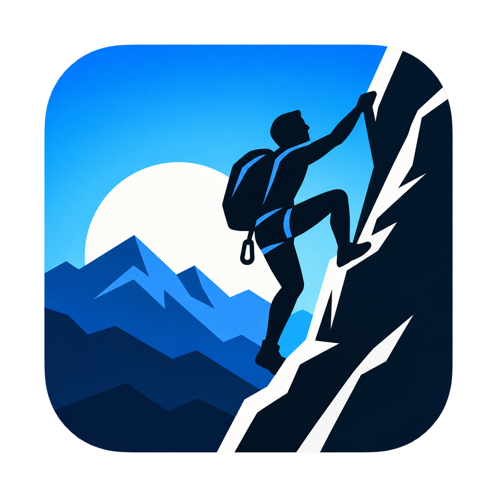

# Climb Indoor Training



A Garmin Connect IQ watch app for indoor climbing sessions on fēnix 8. Record Rope and Boulder attempts in one activity, mark each attempt as successful or failed, and review your training results on the watch and in the saved FIT activity.

## Features

- One activity containing multiple climb attempts, with an individual lap for each completed attempt.
- Rope, Boulder, and experimental Auto modes; switch modes between attempts.
- Manual Rope start with automatic finish after sustained descent, plus a manual finish option.
- Manual Boulder start and finish, including short failed attempts.
- A Success / Failed choice after each completed attempt.
- Total attempts, success percentage, and successful/failed counts by climbing type.
- Climb and rest timers, relative height gain, and heart-rate data when available.
- Session pause, resume, save, and discard.
- Left-side page indicators and an exit from the opening screen before recording starts.
- Configurable detection sensitivity and climb-summary duration.

Success rate is `successful attempts / rated attempts × 100`. An attempt preserved during a forced shutdown without a chosen result is marked unrated and excluded from that percentage.

## Supported watches

| Watch | Build profile |
|---|---|
| fēnix 8 43 mm AMOLED | `fenix843mm` |
| fēnix 8 47 / 51 mm AMOLED | `fenix847mm` |
| fēnix 8 Solar 47 mm | `fenix8solar47mm` |
| fēnix 8 Solar 51 mm | `fenix8solar51mm` |
| fēnix 8 Pro 47 / 51 mm, including MicroLED | `fenix8pro47mm` |

The app requires Connect IQ API level 4.2.3 or later. Builds have been verified with Garmin Connect IQ SDK 9.2.0 and its official device profiles.

## Using the app

1. Open **Climb Indoor Training**. Hold UP/MENU to select **Mode → Rope / Boulder / Auto** before starting, or change mode while resting.
2. Press START to begin the session.
3. Press BACK/LAP to start an attempt. Press it again to finish; Rope can also finish automatically after sustained descent.
4. On the result screen, use UP/DOWN to choose **Success** or **Failed**, then press START to confirm.
5. Continue with further attempts. Press START while resting to open **Resume / Save / Discard** session controls.
6. Save the session to review its totals, results, and success percentage.

| Button | Action |
|---|---|
| START/STOP | Start the session, confirm a result, open session controls, or resume |
| BACK/LAP | Exit before starting; start/finish an attempt; dismiss its completed summary; exit the saved summary |
| UP/DOWN | Change data page or choose an attempt result |
| Hold UP/MENU | Choose the next mode or change settings while resting |

Stopping during a climb asks for confirmation, then its result, before pausing the recording. A result must be chosen before continuing. A zero-duration accidental lap is cancelled.

## Install on a watch

Use the signed `.prg` matching your watch in [`dist/`](dist/). `Climb.prg` and `Climb-Indoor-Training.prg` are aliases of the `fenix847mm` build, for fēnix 8 47 / 51 mm AMOLED.

Transfer the matching file to the watch’s `GARMIN/APPS` folder. fēnix 8 uses MTP, so macOS may require an MTP transfer application. See the [sideload guide](docs/SIDELOAD.md) for device-specific details.

## Garmin Connect results

The saved FIT activity includes climb counts by type, successful and failed totals, success percentage, and readable **Success / Failed** pairs for Rope, Boulder, and Auto. Each climb lap includes its type and outcome flags.

Garmin Connect needs the app’s uploaded Connect IQ display metadata to show those custom fields. Sideloading a `.prg` alone does not register that metadata. The repository includes a production package and a separate-ID private beta package:

- [`Climb-Indoor-Training.iq`](dist/Climb-Indoor-Training.iq)
- [`Climb-Indoor-Training-beta.iq`](dist/Climb-Indoor-Training-beta.iq)

Follow the [Garmin Connect setup guide](docs/CONNECT_SETUP.md) to upload the private beta, install it, record an activity, and sync your watch. Garmin Connect Mobile presentation has not yet been verified through a physical-watch sync.

## Development

### Requirements

- Garmin Connect IQ SDK and official profiles for the target watches.
- Python 3.
- A Garmin developer signing key stored outside this repository.
- Connect IQ Simulator for running the app and tests.

Open the project root in your editor. The optional Garmin Monkey C extension for VS Code provides SDK integration; this repository also includes VS Code build/run tasks.

The CLI discovers an installed SDK automatically. Set `CIQ_SDK` if you need to choose another installation, and `CIQ_KEY` to your signing-key path:

```sh
export CIQ_KEY="/path/to/developer_key.der"
# Optional SDK override:
export CIQ_SDK="/path/to/connectiq-sdk"

python3 tools/ciq.py doctor
python3 tools/ciq.py build --device fenix847mm
```

Launch Connect IQ Simulator, then run the compiled app:

```sh
python3 tools/ciq.py run --device fenix847mm
```

Build a signed watch release:

```sh
python3 tools/ciq.py build --release --device fenix847mm
```

The release command writes `dist/Climb-fenix847mm.prg`. Substitute another supported profile for your watch. See [build instructions](docs/BUILD.md) for additional options.

Signing keys and generated development outputs are excluded by `.gitignore`. Keep signing keys outside the project and never commit them.

### Tests and validation

Fully restart the simulator before a complete test run to clear retained native recording state, then run:

```sh
python3 tools/ciq.py test --device fenix847mm
```

The latest verified suite reports **57 passed, 0 failed, 0 errors**. Release builds for all five profiles and both IQ packages passed without compiler warnings. The suite covers navigation, outcome selection, pause/save ordering, detectors, bounded history, persistence, and native FIT recording.

Garmin’s official FIT decoder verifies the [mixed-mode recording](validation/training-mixed-climbs.json): Rope success, Boulder failure, Auto success, and **66.7% success**, with three attributed climb laps and a cleared final/rest lap. See the [validation report](validation/VALIDATION.md) and [artifact hashes](validation/artifacts.json).

### Project layout

```text
source/       Monkey C application, domain model, recording, sensors, and UI
resources/    App strings, settings, icon, and FIT display definitions
resources-*/  Device-specific launcher-icon sizing
tests/        Simulator tests and expected FIT fixture
tools/       Build/run helper and FIT validator
dist/        Signed watch builds and Connect IQ packages
docs/        Architecture, algorithms, installation, and integration guides
validation/  Test reports, decoded recordings, and artifact hashes
```

## Documentation

- [Architecture](docs/ARCHITECTURE.md)
- [Climb detection](docs/DETECTION_ALGORITHM.md)
- [FIT fields and outcomes](docs/FIT_FIELDS.md)
- [Garmin Connect setup](docs/CONNECT_SETUP.md)
- [Hardware testing](docs/HARDWARE_TEST.md)
- [Implementation decisions](docs/DECISIONS.md)

## Current limitations

Rope and Auto thresholds still need calibration on physical climbs. Auto is experimental: altitude alone can mistake stairs, elevators, or pressure changes for climbing, and short or slow ascents may not trigger detection. Manual BACK/LAP controls remain available.

Physical-watch installation and Garmin Connect Mobile rendering have not yet been verified. Simulator tests validate software behavior and recorded data, rather than real-world detection accuracy.

## Contributing

For a bug report, include your watch model, app mode, steps to reproduce, and expected behavior. For detection issues, describe the climb and descent pattern. Include logs or FIT samples only after removing personal information.

Keep changes focused and run the relevant simulator tests. Changes to FIT fields must preserve existing identifiers and update the schema documentation and expected fixtures. Do not include signing keys or credentials in patches.
