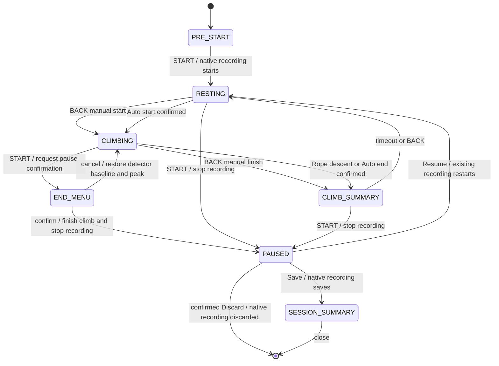
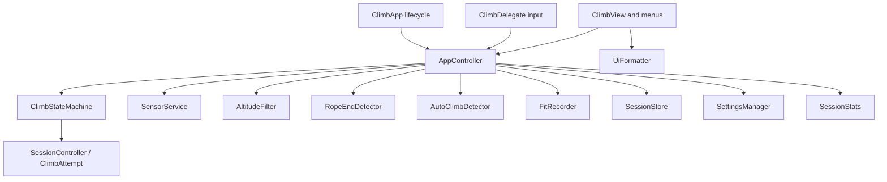
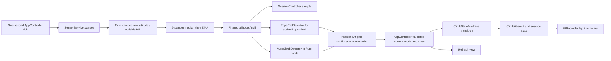
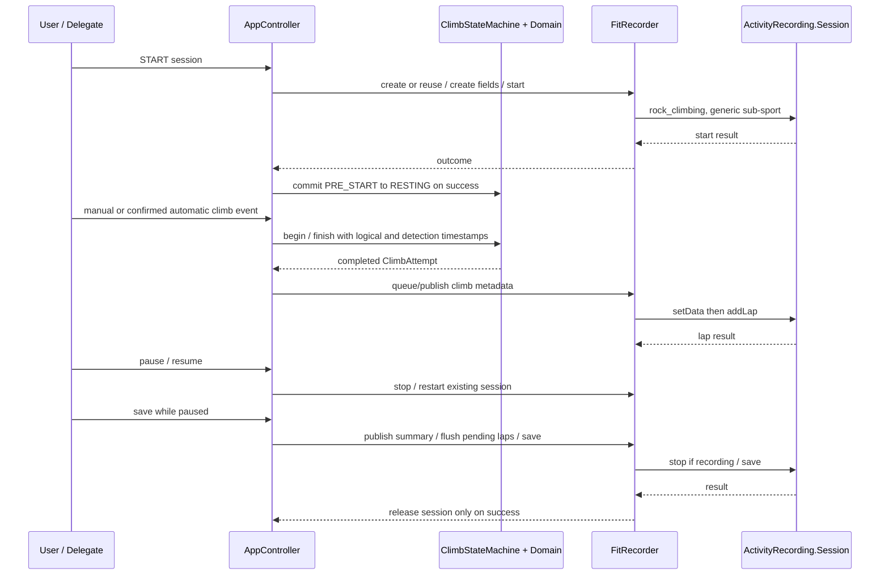

# Architecture

This document describes the current implementation in `source/`. The host watch-app lifecycle enters through `ClimbApp`; `AppController` coordinates input, one-second sampling, sensors, detectors, domain transitions, FIT recording, persistence, and redraw. Detectors stay independent of WatchUi and return timestamped events. `ClimbStateMachine` and `SessionController` remain the authority for legal transitions and workout state.

## Session state machine

The displayed mode is the mode for the next climb; the active climb's mode is fixed at start. Auto detector sub-states (`WATCHING`, `POSSIBLE_START`, `CLIMBING`, `POSSIBLE_END`) are internal to `AutoClimbDetector`, not additional session states. Pause confirmation does not end a climb until accepted. A failed recorder operation must not be presented as a successful state transition.

## Component dependencies

`ClimbView` and menus render controller/domain values and send user actions through the delegate. They do not detect climbs or own a recording session. `FitRecorder` serializes the session and developer fields but does not decide state transitions. `SensorService` gathers nullable sensor readings but does not classify movement. Pure detector classes consume timestamped filtered altitude and do not depend on UI APIs. `SessionStore` persists compact local history separately from the native FIT activity.

## Sensor, detector, and state flow

Altitude remains unavailable until the filter has five consecutive valid readings after startup, null input, reset, or a gap over 2.5 seconds. Null is never treated as zero. Rope detection runs only during an active Rope climb. Auto watches only while its mode is selected and the session is resting or climbing. Menus suspend automatic evaluation. An accepted Auto start replays only retained HR samples at or after its logical candidate start into the new climb; session HR has already counted those samples, so replay does not change session aggregates.

## FIT recording flow

The native lap boundary occurs when Garmin accepts `addLap`; the custom fields carry logical climb duration and can preserve peak-time semantics when automatic confirmation is later. The saved mixed-mode simulator fixture has been decoded: three climb laps, a final cleared implicit/rest lap, 22 registered developer fields, and a matching session summary. See [FIT_FIELDS.md](FIT_FIELDS.md). Failed pending laps remain queued for retry on resume and prevent save until flushed; recorder/session errors are shown through the controller.

## Lifecycle and storage

The controller runs one one-second timer while active. It stops timer and sensor work on inactivity, clears volatile readings and filter state, and resumes from fresh samples. If a climb is active, its domain and detector peak/baseline are preserved while trend continuity is broken. Inactive lifecycle cleanup does not call sensor APIs. App shutdown attempts to close or save a live recording and retains a failure message in logs if closure fails.

Properties hold small settings. Completed climb history is bounded to 256 attempts and stored in pages, with failed pages retained in a bounded in-memory retry queue. Native FIT is the shareable activity record; local history storage is independent. No persisted session is used to resurrect a native `ActivityRecording.Session` after process death.

## Validation evidence

Milestone status and latest counts are maintained in [IMPLEMENTATION_PLAN.md](IMPLEMENTATION_PLAN.md). FIT schema and decoded artifact are documented in [FIT_FIELDS.md](FIT_FIELDS.md). Software-level simulator evidence does not replace physical-device sideload, Garmin Connect presentation review, or real-climbing threshold calibration.
